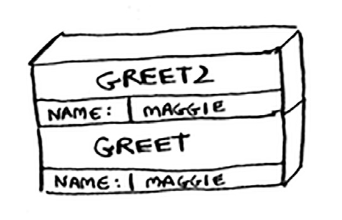

### 3.1 Suppose I show you a call stack like this.

### What information can you give me, just based on this call stack?
 >the `GREET 2` will be called first then the `greet 1` 

3.2 Suppose you accidentally write a recursive function that runs
forever. As you saw, your computer allocates memory on the
stack for each function call. What happens to the stack when your
recursive function runs forever?

>the call stack will increase till it be full and crash(stack overflow)
